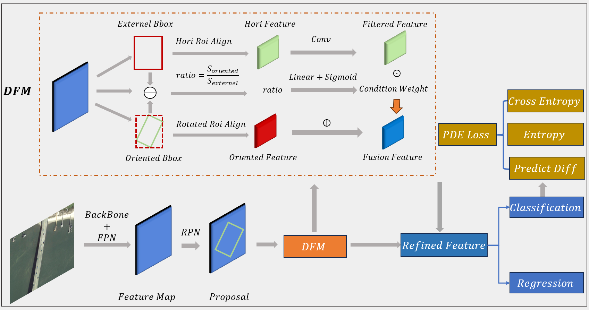
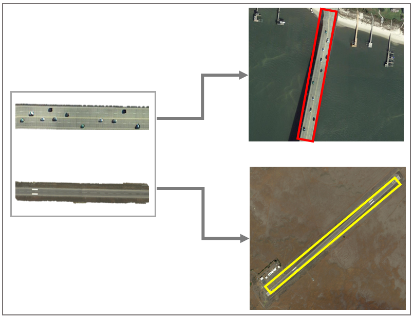
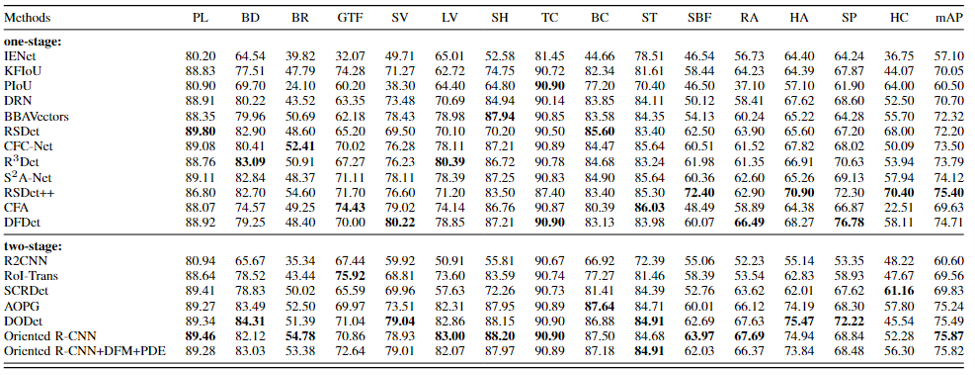

# 基于背景信息融合与联合损失优化的旋转目标检测模型
模型结构图


## Abstract
主流研究专注于如何最大限度地将提取的特征与目标形状对齐时，本文发现了被大多数主流研究所忽略的地方，那就是旋转物体附近的背景中可能潜藏着可以辅助检测的关键信息。对于某些判别性特征不明显的目标之间，仅仅使用目标本身特征可能限制了分类的性能。如下图所示，如果单独关注桥面或公路的特征，无论是经过人眼观察或是经过特征图的特征提取，两者很容易被错判。而如果考虑桥面或者公路附近的背景信息，则会将海洋以及土地的背景信息纳入，由于海洋与土地的背景信息差异显著，因此能够极大地帮助判断当前目标的真实类别。

针对上述问题，本文提出了基于背景信息融合与联合损失优化的旋转目标检测模型。具体来说，针对分类与回归任务，不再仅仅使用与旋转框本身适配的特征，而是设计了一个旋转水平双层特征信息融合模块，引入旋转框的外接水平框的特征与旋转框本身特征进行特征信息加权融合，获得融合特征，进而进行后续的分类与回归。
另外，从损失函数出发，针对目标本身特征相似导致分类难的样本，设计了基于预测差异与熵约束的联合优化损失函数，指导网络更加关注分类困难样本。
## Installation
本项目基于MMrotate开源框架进行改进，具体的环境依赖、安装步骤以及数据准备参照MMrotate官方库[mmrotate仓库](https://github.com/open-mmlab/mmrotate)
模型config文件见[模型配置](./configs/oriented_rcnn/feature_oriented_rcnn_r50_fpn_1x_dota_le90.py),提出了新的[OrientedFeatureRoIHead](./mmrotate/models/roi_heads/oriented_feature_roi_head.py),以及新的[LOSS](./mmrotate/models/losses/max_diff_cross_entropy_loss.py)
## Results
目前实验的结果
### DOTA

## Running
### Training
训练命令
```shell
mkdir logs
nohup python tools/train.py configs/oriented_rcnn/feature_oriented_rcnn_r50_fpn_1x_dota_le90.py --work-dir logs/feature/ > logs/feature.log 2>&1 &
```

### Testing
测试命令，可以得到上面得结果
```shell
nohup python tools/test.py logs/feature/feature_oriented_rcnn_r50_fpn_1x_dota_le90.py logs/feature/latest.pth --format-only --eval-options submission_dir=logs/feature/feature-results > logs/feature/nohup.log 2>&1 &
```

### Others
其他功能的一些命令

## 其他需要说明的
所有的相关图示都在[ppt文件](./最终论文图片.pptx)中。
当前实验效果相比baseline只在个别类别上有所提升，总体精度保持不变，推测的可能性有：
1. 背景信息引入为大部分类别带来了噪声，需要进一步考虑能够抑制噪声同时利用信息的特征提取与融合方法，例如并不局限于水平外接框等
2. 数据集本身不满足假设条件（即存在大量特征相似的类别），可以手动构建一些数据集进行下一步验证
